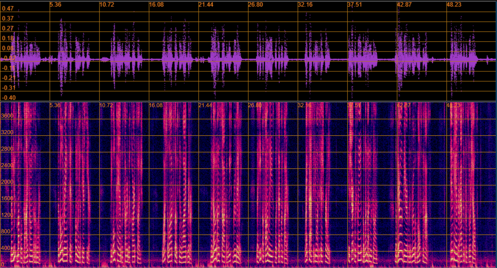
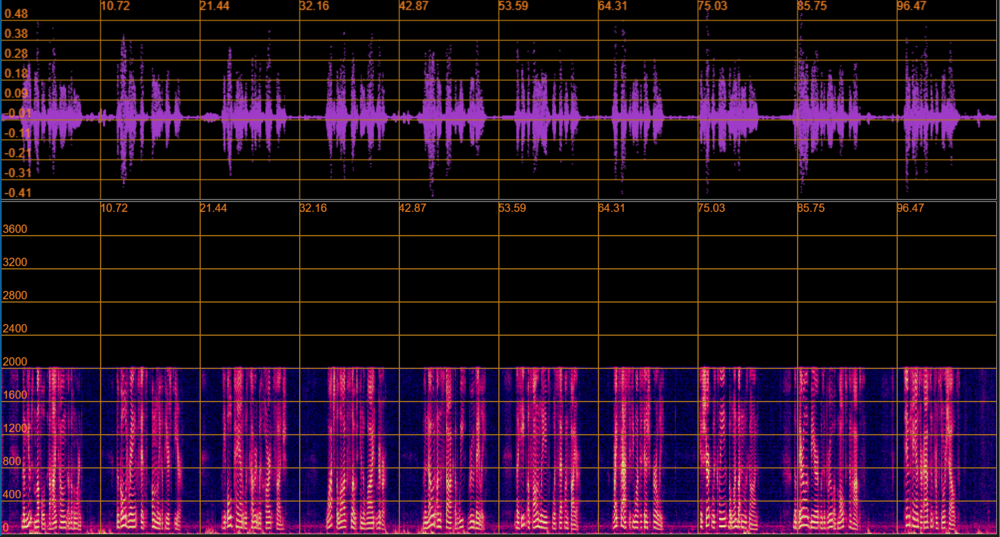
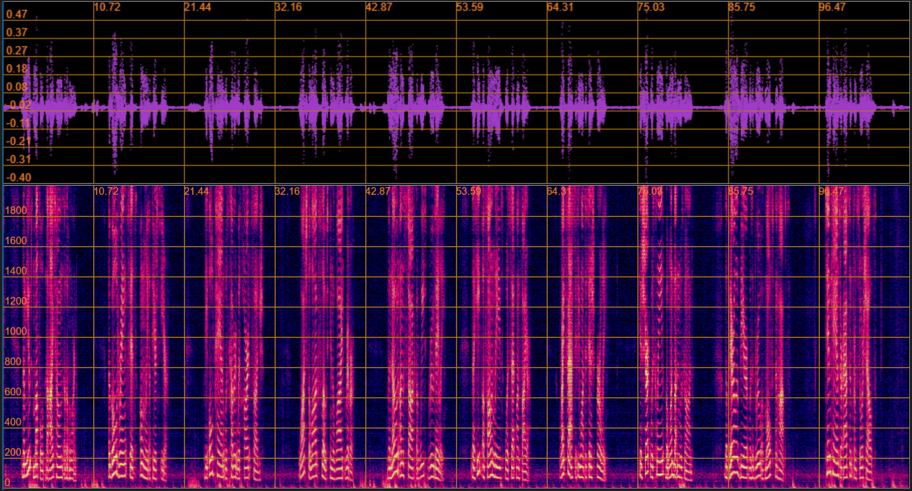
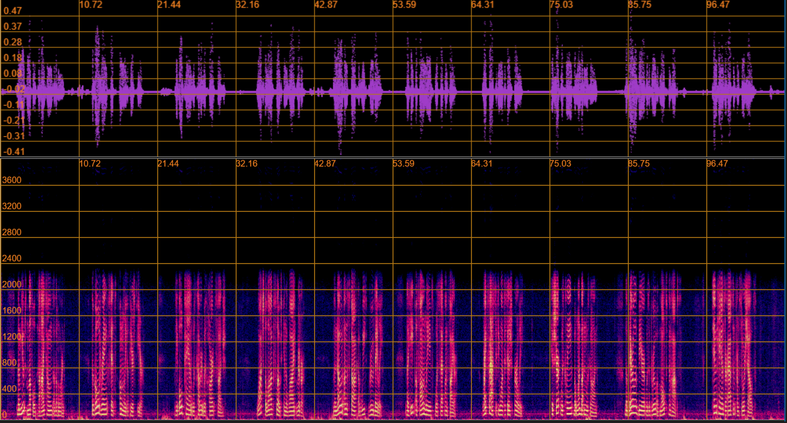

# audio_tool
Консольное приложение для работы с аудиофайлами формата (_.wav_)  

Реализованный функционал:
* Измение аудиофайла
  * Изменение скорости
  * Изменение громкости
* Транскрибирование (**_speech2text_**) аудиофайла и запись расшифровки в файл формата (_.json_)
## Установка
### C помощью _Docker_ (Рекомендовано)
Рекомендуемый способ запуска программы, предотвращающий проблемы с зависимостями.  
**Сборка контейнера**
```bash
docker build -t audio_tool . 
```
**Запуск контейнера.**  
* Чтобы иметь возможность запускать скрипт вручную необходимо запускать в интерактивном режиме (_--it_).
* Для того, чтобы иметь возможность просматривать выходные файлы на хост машине, монтируем локальную директорию с папкой, куда сохраняются файлы в контейнере (_--mount_)
```bash
docker run -it --mount src="$PWD",target=/app/data/outputs,type=bind audio_tool
```
### C помощью venv
**Создание виртуального окружения**
```bash
python -m venv venv
```
**Активация виртуального окружения**
* Windows
```Powershell
venv\Scripts\activate.bat
```
* Linux/MacOS
```bash
 source venv/bin/activate
```
Установка необходимых модулей
```
pip install -r requirements.txt
```
## Использование
```bash
python audio_tool.py [--speed <speed_factor> [--method <method>]] [--volume <volume_factor>] [--transcript <model>] <filename>
```
Аргументы:
* _filename_ (обязательный) - путь к аудиофайлу
* Команды
  * _--speed_ <speed_factor> [--method <method\>]   
  Модифирует скорость воспроизведения аудиофайла (speed_factor > 1.0 - ускорение, < 1.0 - замедление).  
  Выполняется одним из 3 методов: 
    * _**fourier**_ - Сэмплинг методом Фурье (по умолчанию) 
    * **_polyphase_** - Сэмплинг методом многофазной фильтрации
    * **_framerate_** - изменением фреймрейта
  * _--volume_ <volume_factor>  
  Модифицирует громкость аудиофайла (volume_factor > 1.0 - увеличение, < 1.0 - уменьшение)
  * _--transcript_ <model\>  
  Расшифровывает текст аудиофайла, записывая результат в файл формата (_.json_)

## Алгоритм работы
Функции для модификации аудиофайла написаны с помощью инструментов _numpy_ и _scipy_.  
Для возможности обработки аудиофайлов с кодировками с разными размерами семплов (например, pcm_s16le, pcm_s24le, pcm_s32le,..) считывание происходит в массив np.int8 (побайтно).  
Затем, в зависимости от алгоритма и размера сэмпла байты собираются в числа с помощью специальных функций.
## Изменение скорости
Скорость изменяется тремя способами (два алгоритма ресемплинга и изменение частоты дискретизации (фреймрейта)).  
Преимущества подходов:
  * **Ресемплинг**
    * **Не изменяется исходная частота дискретизации** - таким образом измененное аудио будет доступно в тех же инструментах и на тех же устройства, что и исходное.
    * При замедлении аудио уменьшается размер файла
    * **Сохранение высоты звука** - ресемплинг помогает более эффективно сохранять частоту звуковых колебаний, в результате чего измененное аудио меньше отличается от оригинала в плане звучания.
  * **Изменение частоты дискретизации**
    * Сохранение размера файла
    * Простота (как реализации, так и вычисления)
    * Исходные байты не выбираются (сэмплятся), поэтому информация не теряется

  
Исходный файл            |  Ресемплинг методом фурье | Изменение частоты дискретизации | Ресемплинг методом многофазной фильтрации
:-------------------------:|:-------------------------:|:-------------------------:|:-------------------------:
  |   |  |  

Графики амплитуды и частоты сигналов.
## Изменение громкости
Сигнал проходит несколько стадий обработки:
1. Нормализуется (чтобы избежать превышения лимитов целочисленных переменных)
2. Значения амплитуды сигнала умножаются на выбранный пользователем множитель
3. Амплитуды, абсолютное значение которых выше 1.0 обрезаются до 1.0 с соответствующим знаком (также во избежании превышения лимитов целочисленных типов)
4. Новый сигнал денормализуется и записывается в файл
## Транскрипция аудио
Для транскрипции аудиофайлов применяется трансформерная модель [OpenAI Whisper](https://github.com/openai/whisper).  
В данном решении доступны две модификации модели (_tiny, base_).